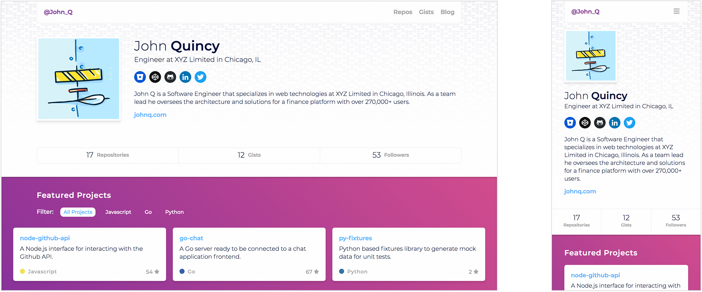

# HubbleJS Default Theme

This is the default theme for [HubbleJS](https://github.com/Polyneue/hubblejs), the developer portfolio powered by Github. This theme makes it easy to get an optimized and easily customizable portfolio site up in minutes.

## Features

* Easily customizable via colors, patterns, and project selection
* Fast page speed due to static files
* Web Accessibility Support
* Competitive [metrics](#metrics) in Google [Lighthouse](https://developers.google.com/web/tools/lighthouse/)
* Structured data for [Schema.org](http://schema.org/)

## Examples

The default theme comes with both a [dark](./examples/images/hubblejs-default-theme-dark-example-1.png) and [light](./examples/images/hubblejs-default-theme-light-example-1.png) base options. To see other examples of generated themes, visit the [examples](./examples) directory.



## Getting Started

After following installation instructions for [HubbleJS](https://github.com/Polyneue/hubblejs), configure the theme property for the HubbleJS configuration.

```javascript
const Hubble = require('hubble.js');

// Instantiate an instance of HubbleJS
const hubble = new Hubble({
  username: 'GITHUB_USERNAME',
  token: 'GITHUB_TOKEN',
  theme: {
    // Options here
  }
});

hubble.generate();
```

## Configuration

The HubbleJS default theme has a number of configurable options to make the end results unique for each generated site. All theme configuration properties are optional.

```javascript
const hubble = new Hubble({
  username: 'GITHUB_USERNAME',
  token: 'GITHUB_TOKEN',

  // Theme definitions
  theme: {
    // Role title for presentation
    title: 'Developer',
  
    // Bio content displayed in the about section
    // Default: '{ user } is a { title } in { location } at  { company }'
    description: 'My HubbleJS description',
  
    // HTML Meta data
    meta: {
  
      // The page description meta tag
      // Default: same as the description property above
      description: 'My meta description',
  
      // Title tag text,
      // Default: '{ user }\'s Development Portfolio'
      title: 'John Smith\'s Development Portfolio',
  
      // Path to custom favicon file,
      // Default: HubbleJS favicon
      favicon: './path/to/my/favicon.ico',

      // Google Analytics Token
      ga: ''
    },
  
    // Navigation definitions
    // Each key is displayed in the navigation with the value as the url
    navigation: {
      Blog: 'www.myblog.com'
    },
  
    // Light or Dark mode selection
    // Default: light
    type: 'light',
  
    // Color definitions for the theme in HEX
    palette: {
      primary: '#F94878',
      secondary: '#753AA8'
    },
  
    // Pattern Definitions
    pattern: {
  
      // Name of the pattern from heropatterns.com
      name: 'morphing diamonds',
  
      // Size of the background pattern
      size: '100px'
    },
  
    // Social media definitions, value is the URL
    social: {
      behance: '',
      bitbucket: '',
      codepen: '',
      dribbble: '',
      facebook: '',
      github: '',
      instagram: '',
      linkedin: '',
      medium: '',
      npm: '',
      stackoverflow: '',
      twitter: ''
    }
  }
});
```

## Metrics
There are a variety of ways to measure the performance of a website, for HubbleJS I decided to use Google Chrome's [Lighthouse](https://developers.google.com/web/tools/lighthouse/) audit, as it seems to be a standard available to everyone. The following results are from a site using the topography pattern, with 8 repositories, 3 gists, and 3 contributing repositories. 

| Performance | Accessibility | Best Practices | SEO |
| ----------- | ------------- | -------------- | --- |
|          94 |           100 |             94 |  89 |

## Versioning

The HubbleJS default theme uses [SemVer](http://semver.org/) for versioning. For available versions, see the [tags for this repository](https://github.com/Polyneue/hubblejs-default-theme/releases).

## License and Attribution

Copyright (c) 2018 Ed Mendoza.   
Code released under the [MIT license](./LICENSE).

### Attributions

* [Hero Patterns](http://www.heropatterns.com/) by Steve Schoger, used under [CC by 4.0](https://creativecommons.org/licenses/by/4.0/)
* [Avatar](http://avatars.adorable.io/) by [adorable.io](https://adorable.io/), used under [MIT License](https://github.com/adorableio/avatars-api-middleware/blob/develop/LICENSE)